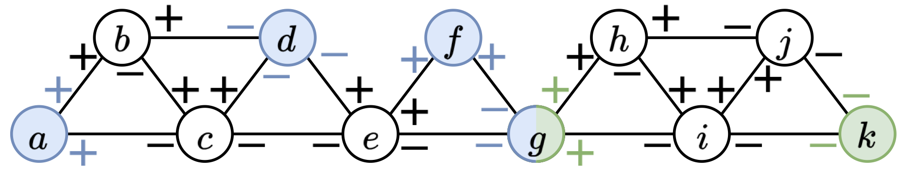

# BubbleFinder

`BubbleFinder` is a program computing all snarls and superbubbles in genomic and pangenomic GFA graphs (i.e. bidirected graphs). `BubbleFinder` computes in linear-time a representation of all snarls whose size is linear in the size of the input graph. Superbubles are already known to be representable in linear time, as pairs of endpoints. 

`BubbleFinder` exploits the [SPQR trees](https://en.wikipedia.org/wiki/SPQR_tree) of the biconnected components of the undirected counterparts of the input bidirected graph, and traverses them efficiently to identify all snarls and superbubbles.

BubbleFinder supports two modes:

- `snarl`: computes **all** snarls and is supposed to replicate the behavior of [vg snarl](https://github.com/vgteam/vg) (when run with parameters -a -T). Note that `vg snarl` prunes some snarls to output only a linear-number of snarls; thus `BubbleFinder` finds more snarls than `vg snarls`.
- `superbubbles`: computes superbubbles in a (virtually) doubled representation of the bidirected graph and is supposed to replicate the behavior of [BubbleGun](https://github.com/fawaz-dabbaghieh/bubble_gun). Notice that BubbleGun also reports weak superbubbles, i.e. for a bubble with entry `s` and exit `t`, it also reports the structures which also have an edge from `t` to `s` (thus the interior of the bubble is not acyclic).

# Installation

At the moment, building from source has been tested only on linux:

```
git clone https://github.com/algbio/bubblefinder
cd BubbleFinder
mkdir build
cd build
cmake .. 
make 
mv BubbleFinder ..
```

Now `BubbleFinder` is in the root directory.

`conda` distributions for both linux and macos will be supported in the very near future.

# Running 

To run BubbleFinder:
```
./BubbleFinder -g {graphPath} [--gfa] -o {-, outputPath} [--superbubbles | --snarls] -j {threadsNumber} [-m {stack size per thread in bytes}]
```

# Examples

To run `BubbleFinder` on the tiny example from `example/tiny1.gfa`, run:
```
./BubbleFinder -g example/tiny1.gfa -o example/tiny1.snarls --gfa --snarls
```
After this, you should obtain the file `example/tiny1.snarls` with the following contents:
```
2
g+ k-
a+ d- f+ g-
```
The number of the first line is the number of lines in the file, and the following lines contains incidences such that *any* pair of incidences on each line is a snarl. So the snarls are {g+, k-}, {a+, d-}, {a+, f+}, {a+, g-}, {d-, f+}, {d-, g-}, {f+, g-}.

This is correct, as the graph looks like this:


# Development

## GFA format and bidirected graphs


## Snarl algorithm correctness 

This repository also includes a brute-force implementation that computes all snarls in a naive way, which has been used to check the correctness of the main SPQR-tree-based implementation. This program gets built when building BubbleFinder from source (described above).

To run brute-force tester for snarls is in the `build` directory after building from source:
```
cd build 
./snarls_bf gfaGraphPath
```