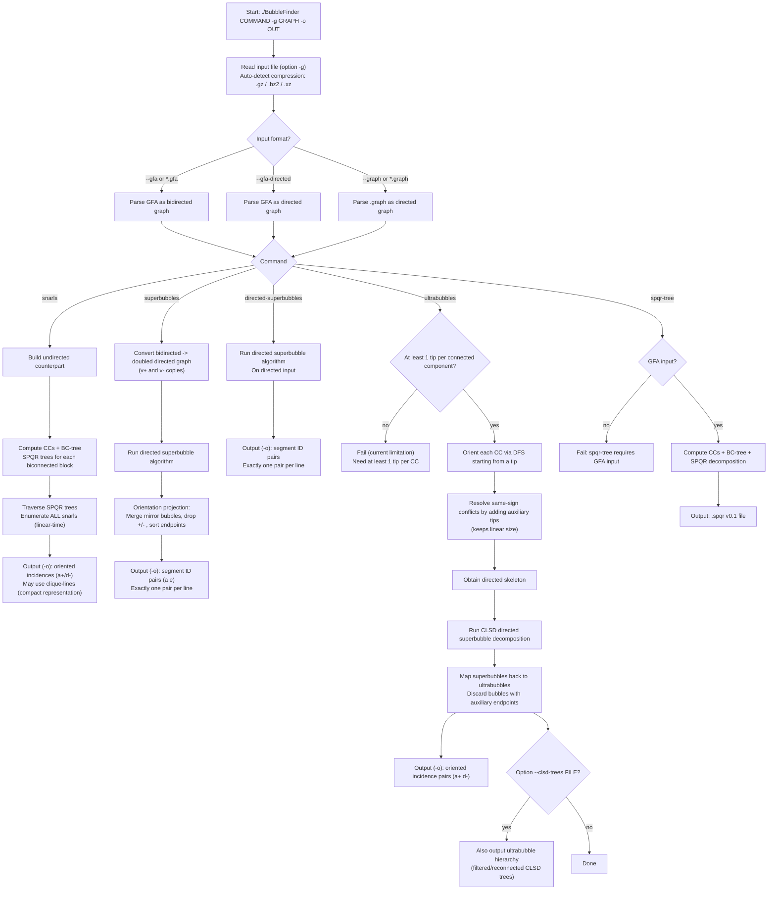

# BubbleFinder

## About

`BubbleFinder` computes **all snarls**, **superbubbles**, and **ultrabubbles** in genomic and pangenomic **GFA graphs** (i.e. bidirected graphs).

BubbleFinder is built around **linear-time algorithms** (linear in the size of the input graph, i.e. `O(|V|+|E|)`), and outputs compact representations:

- **Snarls:** BubbleFinder computes **all snarls** and outputs a representation whose total size is **linear** in the input graph size.
- **Superbubbles:** superbubbles admit a linear-size representation as **pairs of endpoints**, which BubbleFinder outputs.
- **Ultrabubbles:** BubbleFinder computes ultrabubbles in **linear time** by reducing them to directed superbubbles after orienting the bidirected graph (requires **at least one tip per connected component**, see the `ultrabubbles` command notes).

### Snarls and superbubbles via SPQR trees

For snarls and superbubbles, BubbleFinder exploits the [SPQR trees](https://en.wikipedia.org/wiki/SPQR_tree) of the biconnected components of the undirected counterparts of the input bidirected graph, and traverses them efficiently to identify all snarls and superbubbles.

> [!IMPORTANT]
> `snarls` computes **all** snarls and aims to replicate the behavior of [`vg snarls -a -T`](https://github.com/vgteam/vg), **but** `vg` outputs only a pruned, linear-size *snarl decomposition*.  
> Therefore, `BubbleFinder` may output **more** snarls than `vg snarl`.

> [!NOTE]
> **Empirical performance (snarls & superbubbles).** Benchmarks and methodological details are reported in [Sena, Politov et al., 2025](#ref-sena-politov2025).
> - **Snarls:** BubbleFinder is consistently faster than [`vg snarls -a -T`](https://github.com/vgteam/vg) on the PGGB graphs (up to ~2× faster on larger graphs and ~3× on the smallest one). On human chromosome graphs (Chromosome 1/10/22), BubbleFinder can be up to ~2× slower end-to-end in a single-threaded run due to preprocessing (BC/SPQR tree building), but benefits from multi-threading (up to ~4× speedup at 16 threads in those datasets).
> - **Superbubbles:** BubbleFinder runs in similar times as [BubbleGun](https://github.com/fawaz-dabbaghieh/bubble_gun) on small graphs, and is about ~10× faster on larger graphs; in particular, BubbleGun hit a **>3h timeout** on Chromosome 1/10/22, while BubbleFinder completed in minutes in our benchmarks.

### Ultrabubbles via linear-time orientation + reduction to superbubbles

Ultrabubbles are computed using a different approach (not SPQR-based): BubbleFinder first **orients** each connected component of the bidirected graph with a DFS-based procedure (starting from a tip). During this orientation, **conflicts** (same-sign edges whose endpoints are already fixed) are resolved by introducing auxiliary source/sink tips, yielding a directed graph whose size remains **linear** in the original graph size. BubbleFinder then runs a linear-time directed superbubble algorithm on this oriented graph and maps the resulting superbubbles back to ultrabubbles, ignoring bubbles whose endpoints are auxiliary vertices.

> [!NOTE]
> **Empirical performance (ultrabubbles).** In our ultrabubble enumeration benchmarks, BubbleFinder consistently outperformed `vg` across all tested datasets: about **2.25×–2.35×** on 1000GP chromosome graphs, **4.75×–6.38×** on PGGB graphs, **10.66×** on HPRC v1.1, and up to **30.79×** on HPRC v2.0 CHM13 (232 individuals), reducing wall time from **9:09:39** to **17:51**.  
> Peak RAM was generally comparable on smaller graphs, and dropped from **459.90 GiB** to **111.87 GiB** on HPRC v2.0 CHM13 (~**4.11×** less).  
> A dedicated ultrabubble preprint describing this method and its benchmarks is forthcoming (link to be added).

---

## Quickstart

### Prebuilt Linux binary

Download from GitHub Releases and run:

```bash
./BubbleFinder --help
./BubbleFinder snarls -g example/tiny1.gfa -o tiny1.snarls
```

### From source (Linux)

```bash
git clone https://github.com/algbio/BubbleFinder && \
cd BubbleFinder && \
cmake -S . -B build && \
cmake --build build -j <NUM_THREADS> && \
mv build/BubbleFinder .
```

> [!TIP]
> Replace `<NUM_THREADS>` with e.g. `8` for faster builds (`-j 8`).

---

## Commands overview (at a glance)

| Command | Typical input | Output endpoints | Notes |
|---|---|---|---|
| `snarls` | bidirected GFA | oriented incidences (`a+`, `d-`) | may output cliques (compact representation of many pairs) |
| `superbubbles` | bidirected GFA | segment IDs (`a`, `e`) | computed on doubled directed graph + orientation projection |
| `directed-superbubbles` | directed (`--graph` or `--gfa-directed`) | segment IDs | directed superbubbles directly |
| `ultrabubbles` | bidirected GFA | oriented incidences | requires ≥ 1 tip per connected component |
| `spqr-tree` | **GFA only** | `.spqr` v0.1 | connected components + BC-tree + SPQR decomposition |

## Global usage flowchart



---

## Supported commands (detailed)

BubbleFinder supports five commands:

- `snarls`: computes **all** snarls and is supposed to replicate the behavior of [vg snarl](https://github.com/vgteam/vg) (when run with parameters `-a -T`).  
  Note that `vg snarl` prunes some snarls to output only a linear number of snarls; thus `BubbleFinder` finds more snarls than `vg snarl`.

- `superbubbles`: computes superbubbles in a (virtually) doubled representation of the bidirected graph and is supposed to replicate the behavior of [BubbleGun](https://github.com/fawaz-dabbaghieh/bubble_gun).  
  Since superbubbles are classically defined on **directed** graphs, BubbleFinder first runs the algorithm on this doubled directed representation, then projects the results back to unordered pairs of segment IDs (see [Orientation projection](#orientation-projection)).  
  Notice that BubbleGun also reports weak superbubbles, i.e. for a bubble with entry `s` and exit `t`, it also reports the structures which also have an edge from `t` to `s` (thus the interior of the bubble is not acyclic).

- `directed-superbubbles`: computes superbubbles on a **directed** input graph (`--graph` or `--gfa-directed`).

- `ultrabubbles`: computes ultrabubbles by orienting each connected component with a DFS procedure and then running the [clsd](https://github.com/Fabianexe/clsd/tree/c49598fcb149b2c224a4625e0bf4b870f27ec166) superbubble algorithm on the resulting directed skeleton; **requires at least one tip per connected component in the input graph**.

- `spqr-tree`: outputs the connected components, BC-tree (blocks / cut vertices), and SPQR decomposition of each biconnected block in the **SPQR tree file format** `.spqr` **v0.1** as specified here: https://github.com/sebschmi/SPQR-tree-file-format.

As an additional feature, BubbleFinder can also output a **tree hierarchy of ultrabubbles** using `--clsd-trees <file>` (see [Ultrabubble hierarchy (CLSD trees)](#ultrabubble-hierarchy)). This hierarchy is derived from the directed superbubble decomposition computed on the oriented directed skeleton ([Gärtner & Stadler, 2019](#ref-gartner2019direct)). We then transform this superbubble hierarchy into an ultrabubble hierarchy by removing bubbles whose entrance or exit corresponds to an auxiliary vertex introduced during skeleton construction, and by reconnecting their children to the removed bubble’s parent.

> [!WARNING]
> `ultrabubbles` currently requires **at least one tip per connected component** in the input graph (otherwise it will fail).

---

## Table of Contents

- [1. Installation](#installation)
  - [Prebuilt binary (GitHub Releases)](#prebuilt-binary-github-releases)
  - [Building from source](#building-from-source)
  - [Conda](#conda)
- [2. Running](#running)
  - [2.1. Input data](#input)
  - [2.2. Command-line options](#options)
  - [2.3. Output format](#output-format)
    - [2.3.1. Snarls (`snarls` command)](#snarls-output)
    - [2.3.2. Superbubbles (`superbubbles`, `directed-superbubbles`)](#superbubbles-output)
    - [2.3.3. Ultrabubbles (`ultrabubbles`)](#ultrabubbles-output)
    - [2.3.4. Ultrabubble hierarchy](#ultrabubble-hierarchy)
    - [2.3.5. SPQR-tree output (`spqr-tree`)](#spqr-tree-output)
- [3. Development](#development)
  - [GFA format and bidirected graphs](#gfa-format-and-bidirected-graphs)
  - [Orientation projection](#orientation-projection)
  - [Algorithm correctness](#algorithm-correctness)
- [References](#references)

---

# <a id="installation"></a>1. Installation

## <a id="prebuilt-binary-github-releases"></a>Prebuilt binary (GitHub Releases)

A precompiled binary for **Linux (x86‑64)** is available directly in the **Assets** section of the latest GitHub release:

https://github.com/algbio/BubbleFinder/releases/latest

After downloading the asset, extract it and run:

```bash
./BubbleFinder --help
```

## <a id="building-from-source"></a>Building from source

At the moment, building from source has been tested only on Linux:

```bash
git clone https://github.com/algbio/BubbleFinder && \
cd BubbleFinder && \
cmake -S . -B build && \
cmake --build build -j <NUM_THREADS> && \
mv build/BubbleFinder .
```

Replace `<NUM_THREADS>` with the number of parallel build jobs you want to use (for example `-j 8`). Omitting `-j` will build single‑threaded but more slowly.

Now `BubbleFinder` is in the root directory.

## <a id="conda"></a>Conda

A `conda` distribution is planned. Once a package is available, this section will be updated with the exact channel/package name.

---

# <a id="running"></a>2. Running BubbleFinder

Command line to run BubbleFinder:

```text
./BubbleFinder <command> -g <graphFile> -o <outputFile> [options]
```

Available commands are:
  - `superbubbles` - Find bidirected superbubbles (GFA -> bidirected by default)
  - `directed-superbubbles` - Find directed superbubbles (directed graph)
  - `snarls` - Find snarls (typically on bidirected graphs from GFA)
  - `ultrabubbles` - Find ultrabubbles (typically on bidirected graphs from GFA)
  - `spqr-tree` - Output the connected components, BC-tree and SPQR decomposition in `.spqr` v0.1 format

## <a id="input"></a>2.1. Input data

BubbleFinder supports bidirected and directed graphs in [GFA](https://github.com/GFA-spec/GFA-spec) and internal `.graph` format.

BubbleFinder `.graph` text format:
- first line: two integers n and m
    - n = number of distinct node IDs declared
    - m = number of directed edges
- next m lines: `u v` (separated by whitespace),
    each describing a directed edge from `u` to `v`.
- `u` and `v` are arbitrary node identifiers (strings without whitespace).

You can force the format of the input graph with the following flags:

`--gfa`  
  GFA input (bidirected).

`--gfa-directed`  
  GFA input interpreted as a directed graph.

`--graph`  
  BubbleFinder `.graph` text format with one directed edge per line (described above).

If none of these is given, the format is auto-detected from the file extension (e.g., `.gfa`, `.graph`).

Input files can be compressed with gzip, bzip2 or xz. Compression is auto-detected from the file name suffix:

```text
.gz / .bgz  -> gzip
.bz2        -> bzip2
.xz         -> xz
```

> [!NOTE]
> `spqr-tree` currently requires **GFA input**.  
> The internal `.graph` format is not supported for `spqr-tree`.

## <a id="options"></a>2.2. Command line options

Complete list of options:

`-g <file>`  
  Input graph file (possibly compressed)

`-o <file>`  
  Output file

`-j <threads>`  
  Number of threads

`--gfa`  
  Force GFA input (bidirected)

`--gfa-directed`  
  Force GFA input interpreted as directed graph

`--graph`  
  Force .graph text format (see 'Format options' above)

`--clsd-trees <file>`  
  Compute CLSD superbubble trees (hierarchy) and write them to `<file>`.  
  Only supported for the `ultrabubbles` command.

`--report-json <file>`  
  Write JSON metrics report

`-m <bytes>`  
  Stack size in bytes

`-h`, `--help`  
  Show the help message and exit

## <a id="output-format"></a>2.3 Output format

All commands write plain text to the file specified by `-o <outputFile>` with the same global structure (unless stated otherwise by a specific option):

- **First line**: a single integer `N`, the number of *result lines* that follow.
- **Lines 2..N+1**: one *result line* per line.

Each result line encodes one or more **unordered pairs of endpoints**.  
What an "endpoint" looks like depends on the command:

- `snarls` / `ultrabubbles`: endpoints are **oriented incidences**, e.g. `a+`, `d-`.
- `superbubbles` / `directed-superbubbles`: endpoints are **segment IDs without orientation**, e.g. `a`, `e`.

The only difference between commands is:

- `snarls` may output **cliques** (a line with ≥ 2 endpoints encodes all pairs between them),
- `superbubbles` and `directed-superbubbles` always output **exactly one pair per line**.

### <a id="snarls-output"></a>2.3.1 Snarls (`snarls` command)

Used by the `snarls` command.

- After the header, each line contains **at least two incidences**, separated by whitespace.
- An **incidence** is a segment (or node) ID followed by an orientation sign, e.g. `a+`, `d-`.

Example on the tiny graph in `example/tiny1.gfa`:

```bash
./BubbleFinder snarls -g example/tiny1.gfa -o example/tiny1.snarls --gfa
```

This produces:

```text
2
g+ k-
a+ d- f+ g-
```

Interpretation:

- The first line `2` means: **2 result lines follow**.
- Each result line with `k ≥ 2` incidences encodes **all unordered pairs among them**:
  - `g+ k-` encodes the single pair `{g+, k-}`.
  - `a+ d- f+ g-` encodes the clique of pairs:
    `{a+, d-}`, `{a+, f+}`, `{a+, g-}`, `{d-, f+}`, `{d-, g-}`, `{f+, g-}`.

So the snarl output is just a compact way to write many pairs at once:  
**one line = all pairs between the listed incidences**.

### <a id="superbubbles-output"></a>2.3.2 Superbubbles (`superbubbles`, `directed-superbubbles`)

Used by:

- `superbubbles` (bidirected graphs from GFA),
- `directed-superbubbles` (directed graphs: `--graph` or `--gfa-directed`).

Here each result line contains **exactly two tokens**, e.g.:

```text
3
a b
e f
b e
```

Interpretation:

- Each line `u v` is a single **unordered pair of segment IDs** `{u, v}`.
- IDs are segment names from GFA `S` records (no `+/-` orientation).

For `superbubbles`, these pairs are obtained after running the superbubble algorithm on the **doubled directed graph** and then applying the **orientation projection** (see [Orientation projection](#orientation-projection)).

### <a id="ultrabubbles-output"></a>2.3.3 Ultrabubbles (`ultrabubbles`)

Default ultrabubble output (written to `-o <outputFile>`) is a **flat list** of endpoint pairs where each endpoint is an **oriented incidence** (`segmentID+` / `segmentID-`):

```text
N
a+ d-
g+ k-
...
```

Interpretation:

- each result line contains exactly two oriented incidences,
- each line encodes one unordered pair of oriented incidences `{u±, v±}`.

### <a id="ultrabubble-hierarchy"></a>2.3.4 Ultrabubble hierarchy

To also output the hierarchical decomposition (/nesting structure) of ultrabubbles, run `ultrabubbles` with `--clsd-trees <file>`.

#### `--clsd-trees` output file

Each line corresponds to one rooted tree and follows a parenthesized representation:

- a leaf bubble is printed as:
  - `<X,Y>`
- an internal bubble with children is printed as:
  - `(child1,child2,...,childk)<X,Y>`

where `X` and `Y` are oriented incidences such as `a+` or `d-`.

Implementation detail (relevant for interpretation): during construction of the directed skeleton, BubbleFinder may introduce auxiliary intermediate vertices. The CLSD decomposition is computed on that skeleton, and the reported ultrabubble decomposition is obtained by removing bubbles whose entrance or exit is such an introduced vertex. Their children are connected upward in the resulting hierarchy.

### <a id="spqr-tree-output"></a>2.3.5 SPQR-tree output (`spqr-tree`)

The `spqr-tree` command writes a `.spqr` file according to the **SPQR tree file format** specification:

- Specification repository: https://github.com/sebschmi/SPQR-tree-file-format
- Version used by BubbleFinder: **v0.1**

BubbleFinder writes the header line:

```text
H v0.1 https://github.com/sebschmi/SPQR-tree-file-format
```

For details on the line types and semantics (H/G/N/B/C/S/P/R/V/E), please refer to the specification repository above, which contains the format documentation and examples.

---

# <a id="development"></a>3. Development

## <a id="gfa-format-and-bidirected-graphs"></a>GFA format and bidirected graphs

If you look at `example/tiny1.png` you'll notice that the bidirected edge `{a+, b+}` appearing in the graph image has been encoded as:

```text
L	a	+	b	-	0M
```

This is because in GFA, links are directed. So, the rule is that to compute snarls from a GFA file, for every link

```text
a x b y
```

in the GFA file (where `x, y ∈ {+, -}`), we flip the second sign `y` as `¬y`, and make a bidirected edge `{a x, b ¬y}`. Then we compute snarls in this bidirected graph.

## <a id="orientation-projection"></a>Orientation projection

Superbubbles are classically defined on **directed** graphs, whereas GFA graphs are **bidirected**. In `superbubbles` mode, BubbleFinder therefore first converts the bidirected graph into a doubled directed graph, where each segment `v` has two oriented copies `v+` and `v-`, and superbubbles are detected between oriented endpoints (e.g. `(a+, e-)` and its mirror `(e+, a-)`).

To report results at the level of segments, independently of the arbitrary orientation chosen in the doubled graph, we apply an **orientation projection**:

- mirror pairs like `(a+, e-)` and `(e+, a-)` are treated as the same bubble;
- we then drop the `+/-` signs and sort the two segment names.

The final output is a single unordered pair of segment IDs, e.g. `a e`. This process is illustrated below.

<p align="center">
  
</p>

In this example, the directed graph on segments has three superbubbles with endpoints `(a, b)`, `(b, e)` and `(e, f)`. After running the superbubble algorithm on the doubled graph and applying the orientation projection, BubbleFinder reports exactly these three pairs in its standard output format (see [Output format](#output-format)).

## <a id="algorithm-correctness"></a>Algorithm correctness

This repository includes a brute-force implementation and a random test harness to validate both the snarl and superbubble algorithms.

### Brute-force implementation

A brute-force program is built together with BubbleFinder from source and resides in the `build` directory after compilation. It can compute snarls and, in a different mode, superbubbles on a given GFA file. In the examples below we refer to this binary as `./build/snarls_bf`.

To run the brute-force program on **snarls** for a given GFA file:

```bash
cd build
./snarls_bf gfaGraphPath
```

The brute-force program outputs results in a format consumed by `src/bruteforce.py`, which then compares them with BubbleFinder’s output. The same brute-force engine is also used for superbubble validation via the `--superbubbles` mode, which takes care of running the binary and parsing its output.

### Random testing with `src/bruteforce.py`

We also include a generator of random graphs and a driver script that compares the brute-force implementation with BubbleFinder. The script is `src/bruteforce.py`, and it can operate in two modes:

- **Snarls** (default)
- **Superbubbles**
- **Ultrabubbles**

#### Snarls

To run the random tests on snarls (for example, on 100 random graphs):

```bash
python3 src/bruteforce.py \
  --bruteforce-bin ./build/snarls_bf \
  --bubblefinder-bin ./BubbleFinder \
  --n-graphs 100
```

This will:

- generate random GFA graphs,
- run the brute-force snarl finder,
- run BubbleFinder in snarl mode,
- compare their outputs (missing / extra pairs / segfaults),
- and additionally check that BubbleFinder’s output is consistent across different thread counts if you pass several values to `--threads`.

#### Ultrabubbles

To run random tests on ultrabubbles, use the brute-force ultrabubble binary (e.g. `./build/ultrabubbles_bf`). Since the current ultrabubble implementation in BubbleFinder requires **at least one tip per connected component**, you can restrict the generated random graphs with:

```bash
python3 src/bruteforce.py \
  --bruteforce-bin ./build/ultrabubbles_bf \
  --bubblefinder-bin ./BubbleFinder \
  --n-graphs 100 \
  --min-tips-per-cc 1
```

#### Superbubbles

To run the same style of tests for superbubbles, pass the `--superbubbles` flag:

```bash
python3 src/bruteforce.py \
  --superbubbles \
  --bruteforce-bin ./build/superbubbles_bf \
  --bubblefinder-bin ./BubbleFinder \
  --n-graphs 100
```

To run superbubble tests with multiple thread configurations and check result consistency, you can run:

```bash
python3 src/bruteforce.py \
  --superbubbles \
  --bruteforce-bin ./build/superbubbles_bf \
  --bubblefinder-bin ./BubbleFinder \
  --n-graphs 100 \
  --threads 1 4 8
```

Any divergence or error is reported, and if you pass `--keep-failing`, the script will save the corresponding GFA and BubbleFinder outputs in `/tmp` for manual inspection.

---

## References

- <a id="ref-sena-politov2025"></a> Francisco Sena, Aleksandr Politov, Corentin Moumard, Manuel Cáceres, Sebastian Schmidt, Juha Harviainen, Alexandru I. Tomescu. *Identifying all snarls and superbubbles in linear-time, via a unified SPQR-tree framework*. arXiv:2511.21919 (2025). https://arxiv.org/abs/2511.21919

- <a id="ref-gartner2019direct"></a> Fabian Gärtner, Peter F. Stadler. *Direct superbubble detection*. Algorithms 12(4):81, 2019. DOI: 10.3390/a12040081. https://www.mdpi.com/1999-4893/12/4/81

- <a id="ref-vg"></a> vg toolkit (GitHub): https://github.com/vgteam/vg

- <a id="ref-bubblegun"></a> BubbleGun (GitHub): https://github.com/fawaz-dabbaghieh/bubble_gun

- <a id="ref-ultrabubbles-preprint"></a> *Scalable computation of ultrabubbles in pangenomes by orienting bidirected graphs*. Preprint forthcoming (link to be added).